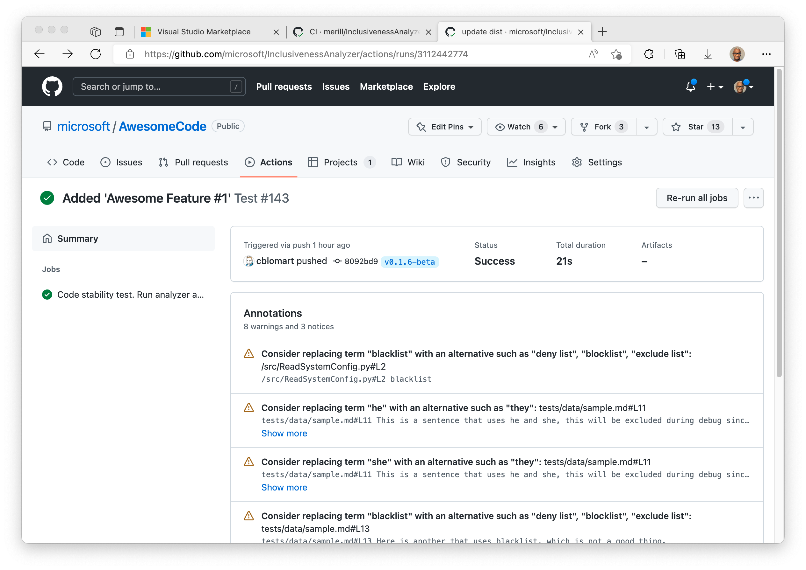

# Inclusiveness Analyzer

> Make your code inclusive!

The Inclusiveness Analyzer is a GitHub action that checks your repository for offensive / exclusive terms.

It also provides context on why a word is exclusive and suggests alternate terms that can be used instead.

## Install Guide

### Add Inclusive Analyzer action to your build workflow

* In your GitHub repository, select the **Actions** tab and either add or edit a workflow.
* Search for **Inclusiveness Analyzer** from the **Marketplace** tab on the right.
* Copy and paste the yaml into your workflow.


Copy paste the following workflow definition into your project `.github/workflows/inclusiveness-analyzer.yml`

```yaml
# This workflow checks out code and scans the content changed or added in the 
# last commit for offensive / exclusive terms.
# The scan will provide context on the found terms and alternatvies that can be
# used instead.

name: Inclusiveness Analyser scan

on:
  push:
  workflow_dispatch:

jobs:
  Inclusiveness-Analyser-scan:
    runs-on: ubuntu-latest
    steps:
    - name: Checkout code
      uses: actions/checkout@v3

    - name: Inclusiveness Analyser scan
      uses: microsoft/InclusivenessAnalyser@v0.1.7
```

* Commit your changes to trigger the workflow or run the workflow manually
* The Annotations view will show the first ten non-inclusive terms that are found.
* You can select the Jobs detail log to view all the instances of non-inclusive terms.


### Action configuration options

Use the options below to configure exclusions and build state when non-inclusive terms are found in the repository.

|          option          |            example             |  description  |
|--------------------------|--------------------------------|---------------|
| `failOnNonInclusiveTerm` |                                | If `false` (Default) the build completes successfully and warnings are provided in the logs.<br/>If `true` the build is failed if non-inclusive terms are found. |
| `excludeUnchangedFiles`  |                                | If `true` (Default) limits the scan to files changed in the latest commit.<br/>If `false` a full scan is run on each commit. |
| `excludeFiles   `        | `**/skipme.txt,**/donotscan/*` | Comma separated list of file patterns to exclude from analysis. [Glob patterns](https://github.com/isaacs/node-glob#glob-primer) are supported with a prefix of `**/` |
| `excludeTerms`           | `he,she`                       | Comma separated list of non-inclusive terms to exclude from analysis. |

## Inclusiveness Analyzer for other Platforms

* [Inclusiveness Analyzer Visual Studio Extension](https://github.com/microsoft/InclusivenessAnalyzerVisualStudio)
* [Inclusiveness Analyzer Azure DevOps Extension](https://github.com/microsoft/InclusivenessAnalyzerAzureDevOps)

## About the project

As humans, we hold many unconscious and implicit biases that we rely on to react quickly to our environment and any novel stimuli. However, since the unconscious brain processes and reacts with speed, we sometimes speak quickly without thinking, which may cause us to slip offensive terms and stereotypes although we mean no malice.

In order to confront these biases that we see in ourselves and others, we must rewire ourselves to regularly use inclusive practices (such as the words we speak). If you don't intentionally and proactively include, you will unintentionally exclude. 

> Join our effort to push out exclusive terms and make inclusive terms a part of our everyday vocabulary!

Help us confront these biases by pushing out exclusive terms and making inclusive terms a part of our everyday vocabulary!

## Contributing

This project welcomes contributions and suggestions.  Most contributions require you to agree to a
Contributor License Agreement (CLA) declaring that you have the right to, and actually do, grant us
the rights to use your contribution. For details, visit https://cla.opensource.microsoft.com.

When you submit a pull request, a CLA bot will automatically determine whether you need to provide
a CLA and decorate the PR appropriately (e.g., status check, comment). Simply follow the instructions
provided by the bot. You will only need to do this once across all repos using our CLA.

This project has adopted the [Microsoft Open Source Code of Conduct](https://opensource.microsoft.com/codeofconduct/).
For more information see the [Code of Conduct FAQ](https://opensource.microsoft.com/codeofconduct/faq/) or
contact [opencode@microsoft.com](mailto:opencode@microsoft.com) with any additional questions or comments.

## Trademarks

This project may contain trademarks or logos for projects, products, or services. Authorized use of Microsoft 
trademarks or logos is subject to and must follow
[Microsoft's Trademark & Brand Guidelines](https://www.microsoft.com/legal/intellectualproperty/trademarks/usage/general).
Use of Microsoft trademarks or logos in modified versions of this project must not cause confusion or imply Microsoft sponsorship.
Any use of third-party trademarks or logos are subject to those third-party's policies.
